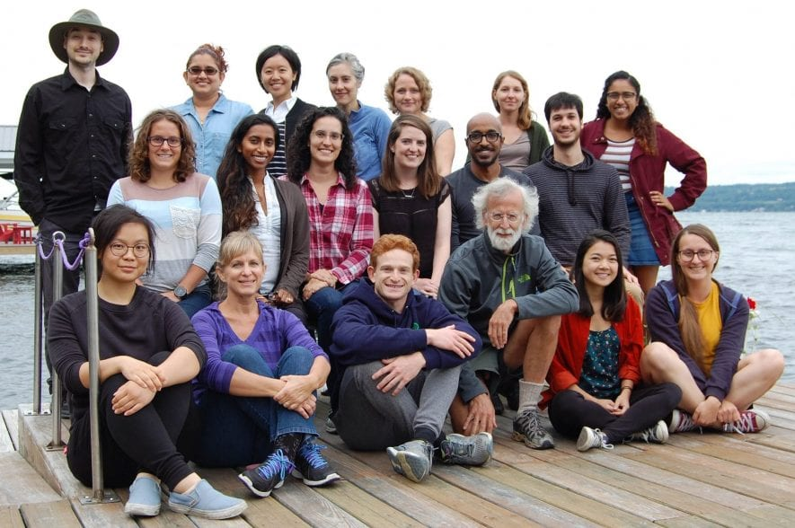

I am a 5th year PhD student in the [Graduate Field of Computational Biology](https://cb.cornell.edu/) at [Cornell University](https://www.cornell.edu/). I earned my B.Sc. in Mathematics in 2015 from [Michigan State University](https://msu.edu/) before moving to Cornell University to work with [Andy Clark](https://blogs.cornell.edu/clarklabblog/). 

TEST. I am interested in the genetic, behavioral, and environmental factors that contribute to speciation. I integrate population genetic theory and computer simulations that model historic processes with large-scale datasets containing whole-genome and -transcriptome information for populations of interest. I currently use this technique to explore and identify interactions between the mitochondrial genome and the nuclear genome in *Drosophila melanogaster*

 